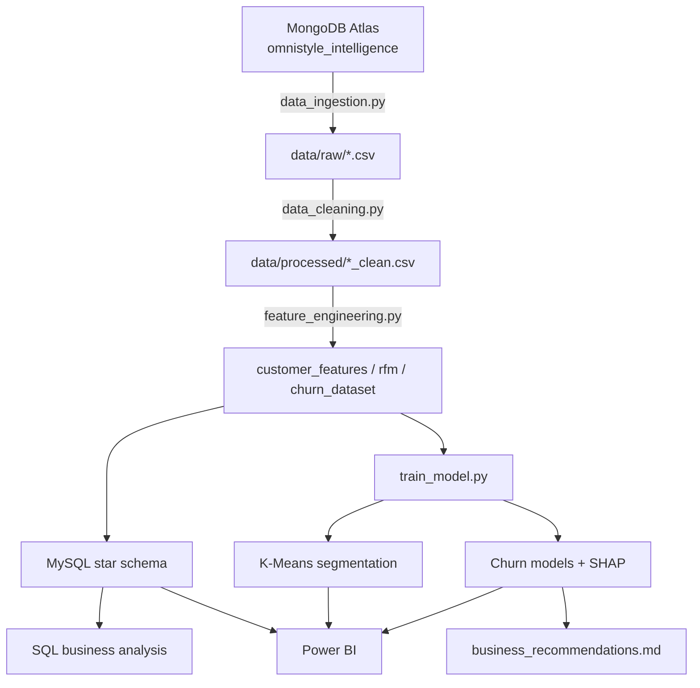

# OmniStyle Customer Intelligence Platform

An end-to-end customer intelligence platform for **OmniStyle**, a fictional
retail clothing brand — built to demonstrate the full data lifecycle from
raw operational data through machine learning and business recommendations.


---

## 1. Project Overview

OmniStyle sells clothing across five categories (Men, Women, Kids,
Accessories, Footwear) through both online and in-store channels. This
project builds a complete intelligence platform on top of OmniStyle's
customer, product, and order data to answer four progressively deeper
business questions:

| Level | Question | How it's answered |
|---|---|---|
| Descriptive | **What happened?** | SQL business analysis + Power BI Executive Overview |
| Diagnostic | **Why did it happen?** | RFM analysis, customer segmentation |
| Predictive | **What will happen?** | Churn prediction model |
| Prescriptive | **What should the business do?** | SHAP explainability + `reports/business_recommendations.md` |

## 2. Business Problem

Retail clothing brands like OmniStyle typically have far more transactional
data than they use effectively. Marketing teams often send blanket
promotions to the entire customer base instead of targeting the right
message to the right customer segment, and by the time a customer has
visibly stopped buying, it's often too late to win them back cost-effectively.

This platform gives OmniStyle:

- A single source of truth for customer and sales analytics (MySQL + Power BI)
- Data-driven customer segments instead of guesswork
- A churn model that flags at-risk customers **before** they fully disengage
- Explainable predictions so retention teams understand *why* a customer is
  flagged, not just that they are

## 3. Key Questions Answered

1. What is our total revenue, and how is it trending month over month?
2. Which products, categories, and regions perform best (and worst)?
3. What distinguishes our most loyal customers from those at risk of leaving?
4. Which customers are likely to churn in the near future, and why?
5. What should the business actually do about it?

## 4. Architecture

```
                    ┌─────────────────────┐
                    │   MongoDB Atlas      │
                    │ omnistyle_intelligence│
                    │  (customers, products,│
                    │   orders collections) │
                    └──────────┬───────────┘
                               │  src/data_ingestion.py
                               ▼
                    ┌─────────────────────┐
                    │  data/raw/*.csv      │
                    └──────────┬───────────┘
                               │  src/data_cleaning.py
                               ▼
                    ┌─────────────────────┐
                    │ data/processed/      │
                    │  *_clean.csv         │
                    │  data_quality_report │
                    └──────────┬───────────┘
                               │  src/feature_engineering.py
                               ▼
                    ┌─────────────────────┐
                    │ customer_features.csv│
                    │ rfm_features.csv     │
                    │ churn_dataset.csv    │
                    └──────────┬───────────┘
                     ┌─────────┴─────────┐
                     ▼                   ▼
        ┌─────────────────────┐  ┌─────────────────────┐
        │  MySQL (star schema) │  │  src/train_model.py │
        │  sql/schema.sql       │  │  - K-Means segments  │
        │  sql/business_analysis│  │  - Churn models      │
        └──────────┬───────────┘  │  - SHAP explainability│
                    │              └──────────┬───────────┘
                    ▼                         ▼
          ┌───────────────────┐    ┌───────────────────────┐
          │   Power BI          │    │  reports/               │
          │  dashboard/          │    │  business_recommendations.md│
          │  sample_data/*.csv   │    │  SHAP plots, model metrics   │
          └───────────────────┘    └───────────────────────┘
```

Mermaid version (renders on GitHub):



## 5. Tech Stack

| Layer | Tools |
|---|---|
| Language | Python 3.11+ |
| Data processing | pandas, numpy |
| Databases | MongoDB Atlas (operational), MySQL (analytics) |
| DB connectivity | pymongo, SQLAlchemy, PyMySQL |
| Machine Learning | scikit-learn (K-Means, Logistic Regression, Random Forest) |
| Explainability | SHAP |
| Visualization | matplotlib, seaborn |
| BI | Power BI (CSV-driven, see `dashboard/`) |
| Testing | pytest |
| Config | python-dotenv |

## 6. Repository Structure

```
omnistyle-customer-intelligence/
├── README.md
├── requirements.txt
├── .gitignore
├── .env.example
├── LICENSE
├── pytest.ini
│
├── data/
│   ├── raw/                  # MongoDB CSV export (generated)
│   ├── processed/            # Cleaned + feature-engineered datasets (generated)
│   └── README.md
│
├── notebooks/
│   ├── 01_data_exploration.ipynb
│   ├── 02_customer_analysis.ipynb
│   ├── 03_segmentation.ipynb
│   └── 04_churn_prediction.ipynb
│
├── src/
│   ├── config.py                  # Centralized env config + logging
│   ├── data_ingestion.py          # Synthetic data generator + MongoDB I/O
│   ├── data_cleaning.py           # Validation, cleaning, data quality report
│   ├── feature_engineering.py     # RFM, customer features, churn labeling
│   ├── load_to_mysql.py           # Loads processed data into MySQL star schema
│   ├── customer_segmentation.py   # K-Means segmentation (canonical implementation)
│   ├── train_model.py             # Churn models, SHAP, first-pass exports (imports segmentation)
│   ├── export_dashboard_data.py   # Standalone Power BI CSV exporter
│   ├── generate_recommendations.py# Standalone business_recommendations.md generator
│   └── run_pipeline.py            # End-to-end orchestrator (all 8 stages)
│
├── sql/
│   ├── schema.sql             # Star schema DDL
│   └── business_analysis.sql  # 17 business intelligence queries
│
├── dashboard/
│   ├── README.md
│   ├── power_bi_guide.md
│   └── sample_data/           # Power BI-ready CSVs (generated)
│
├── docs/
│   ├── architecture.md        # Full architecture + Mermaid/ASCII diagrams
│   ├── data_dictionary.md     # Every table/column across the whole pipeline
│   └── methodology.md         # Data generation, cleaning, RFM, churn, modeling detail
│
├── models/                    # best_churn_model.joblib, metrics (generated)
├── reports/                   # business_recommendations.md, SHAP plots (generated)
└── tests/
    ├── test_data_cleaning.py
    └── test_features.py
```

## 7. Data Pipeline Explanation

1. **Ingestion** (`src/data_ingestion.py`): Generates deterministic,
   behaviorally realistic synthetic data (customers, products, orders with
   embedded line items) and writes it into a dedicated MongoDB Atlas
   database. If `MONGODB_URI` is not configured, the pipeline still runs
   end-to-end by writing straight to `data/raw/*.csv`.
2. **Cleaning** (`src/data_cleaning.py`): Deduplicates, validates IDs and
   numeric fields, parses dates, reconciles order totals against line-item
   detail, and produces a full data quality report.
3. **Feature Engineering** (`src/feature_engineering.py`): Computes RFM
   features and a broader customer feature set, then builds a **leakage-free
   churn label** using a fixed cutoff date and a 90-day forward observation
   window (see the module docstring, or `docs/methodology.md`, for the
   exact definition).
4. **MySQL Load** (`src/load_to_mysql.py`): Loads the cleaned data into a
   star schema (`dim_customer`, `dim_product`, `dim_date`, `fact_sales`).
5. **Segmentation** (`src/customer_segmentation.py`): K-Means on RFM
   features with silhouette-based k-selection and rank-based business
   labeling. This is the canonical implementation — `src/train_model.py`
   imports it rather than duplicating the logic.
6. **Churn Modeling** (`src/train_model.py`): Trains and compares Logistic
   Regression and Random Forest churn models, selects the best one by
   ROC-AUC, and applies SHAP explainability.
7. **Business Recommendations** (`src/generate_recommendations.py`): Reads
   every real artifact produced above and renders
   `reports/business_recommendations.md` using only computed values.
8. **Power BI Export** (`src/export_dashboard_data.py`): Produces
   business-friendly CSVs in `dashboard/sample_data/` (in addition to the
   first-pass exports `src/train_model.py` already writes).

All 8 stages can be run individually as shown in Section 12, or together in
one command via the orchestrator:

```bash
python -m src.run_pipeline              # full pipeline including MySQL
python -m src.run_pipeline --skip-mysql # full pipeline, skipping MySQL load
```

## 8. MongoDB Setup

This project is designed to work with an **existing** MongoDB Atlas Free
Tier cluster — it does **not** require creating a new cluster, and it never
touches any database other than the one it creates for itself.

1. In Atlas, find your existing cluster's connection string
   (Database → Connect → Drivers).
2. Set `MONGODB_URI` in `.env` to that connection string.
3. Leave `MONGODB_DB=omnistyle_intelligence` (or change it — it's just the
   name of a new database on your existing cluster).
4. Make sure your current IP is allow-listed under Atlas **Network Access**.

The pipeline only ever reads/writes the `customers`, `products`, and
`orders` collections inside `MONGODB_DB`. If `MONGODB_URI` is left blank,
the pipeline automatically falls back to generating data straight to local
CSVs, so the project is fully runnable without any MongoDB account at all.

## 9. MySQL Setup

1. Install MySQL locally (or use an existing local/dev instance).
2. Apply the schema:
   ```bash
   mysql -u <user> -p < sql/schema.sql
   ```
3. Set `MYSQL_HOST`, `MYSQL_PORT`, `MYSQL_USER`, `MYSQL_PASSWORD`,
   `MYSQL_DATABASE` in `.env`.
4. Load data with `python -m src.load_to_mysql` (after running the earlier
   pipeline steps).

## 10. Environment Variable Setup

Copy the example file and fill in your own values:

```bash
cp .env.example .env
```

| Variable | Description |
|---|---|
| `MONGODB_URI` | Connection string for your existing MongoDB Atlas cluster |
| `MONGODB_DB` | Database name to use (default: `omnistyle_intelligence`) |
| `MYSQL_HOST` / `MYSQL_PORT` | MySQL server location |
| `MYSQL_USER` / `MYSQL_PASSWORD` | MySQL credentials |
| `MYSQL_DATABASE` | Analytics database name (default: `omnistyle_analytics`) |
| `RANDOM_SEED` | Seed for reproducibility (default: `42`) |
| `NUM_CUSTOMERS` / `NUM_PRODUCTS` / `NUM_ORDERS` | Synthetic data volume overrides |

No secrets are committed to this repository. `.env` is git-ignored.

## 11. Installation Instructions

```bash
# 1. Create a virtual environment
python3 -m venv .venv
source .venv/bin/activate   # Windows: .venv\Scripts\activate

# 2. Install requirements
pip install -r requirements.txt

# 3. Configure environment variables
cp .env.example .env
# edit .env with your MongoDB/MySQL credentials (or leave MONGODB_URI blank)
```

## 12. Step-by-Step Execution

Run these commands in order from the project root:

```bash
# 4. Generate/load synthetic data (MongoDB if configured, else CSV fallback)
python -m src.data_ingestion

# 5. Clean and validate the raw data
python -m src.data_cleaning

# 6. Build RFM / customer features and the churn dataset
python -m src.feature_engineering

# 7. Create the MySQL schema (run once)
mysql -u <user> -p < sql/schema.sql

# 8. Load cleaned + feature data into MySQL
python -m src.load_to_mysql

# 9. Run the business analysis SQL queries
mysql -u <user> -p omnistyle_analytics < sql/business_analysis.sql

# 10. Run customer segmentation
python -m src.customer_segmentation

# 11. Train churn models (Logistic Regression + Random Forest) and SHAP
python -m src.train_model

# 12. Generate the business recommendations report
python -m src.generate_recommendations

# 13. Export Power BI-ready CSVs
python -m src.export_dashboard_data

# 14. (Optional) Explore the notebooks interactively
jupyter notebook notebooks/

# 15. Open Power BI-ready CSVs
# See dashboard/power_bi_guide.md — import files from dashboard/sample_data/
```

Steps 4–6 and 10–13 can also be re-run any time to regenerate everything
from scratch, since all randomness is seeded (`RANDOM_SEED=42` by default).

### Or run everything in one command

Steps 4 through 13 above can be run together with the pipeline orchestrator:

```bash
python -m src.run_pipeline              # runs all 8 stages, including MySQL load
python -m src.run_pipeline --skip-mysql # same, but skips the MySQL load stage
```

See `src/run_pipeline.py` for the exact stage-by-stage breakdown and error
handling (a failure in any required stage halts the run with a clear error;
only the MySQL stage is optional).

### Running tests

```bash
pytest
```

## 13. Machine Learning Methodology

### Customer Segmentation

- Features: Recency, Frequency, Monetary (RFM), standardized with `StandardScaler`.
- Model: K-Means, with `k` chosen via elbow (inertia) and silhouette analysis,
  constrained to a business-actionable range (4–7 clusters — see the
  docstring in `src/train_model.py::choose_k` for why unconstrained
  silhouette maximization is avoided).
- Labeling: Segments are named (Champions, Loyal Customers, Potential
  Loyalists, New Customers, At Risk, Hibernating) based on each cluster's
  **relative rank** on recency/frequency/monetary versus the other clusters
  found — never by arbitrary cluster ID.

### Churn Prediction

- **Baseline:** Logistic Regression (`class_weight="balanced"`, scaled features).
- **Advanced:** Random Forest (`class_weight="balanced"`, unscaled features).
- Stratified 80/20 train/test split, `RANDOM_SEED=42`.
- 5-fold stratified cross-validation on the Random Forest for a robustness check.
- Evaluated on precision, recall, F1-score, ROC-AUC, and confusion matrix.
- **Model selection:** the model with the higher ROC-AUC is selected, since
  ranking customers by churn risk (for retention prioritization) is more
  business-relevant than raw classification accuracy.

### Churn Definition (no data leakage)

A fixed **cutoff date** (90 days before the project's reference date) splits
history into a feature window (everything on/before the cutoff) and a
90-day forward observation window (strictly after the cutoff). A customer is
labeled **churned** if they signed up before the cutoff and made **zero**
purchases during the observation window. Because features are computed only
from data up to the cutoff and the label only from data after it, the
feature set contains no information about the future. See the full
docstring in `src/feature_engineering.py` for details.

### Explainability

SHAP `TreeExplainer` is applied to the selected model when it is
tree-based (Random Forest). Outputs include:
- A global summary plot (`reports/shap_summary_plot.png`)
- A ranked bar chart of the top churn drivers (`reports/shap_feature_importance_bar.png`)
- A local waterfall explanation for one high-risk customer (`reports/shap_local_explanation_example.png`)

## 14. Model Evaluation

Metrics from the most recent training run are saved to
`models/model_metrics.json`. As a reference point from a full 5,000-customer
synthetic run, the Random Forest model achieved an ROC-AUC of roughly 0.93–0.95
with 5-fold cross-validation, comfortably outperforming the Logistic
Regression baseline on ranking quality while remaining close on precision/recall.
Exact numbers will vary slightly by machine/library versions but should be
reproducible given `RANDOM_SEED=42`.

## 15. Key Business Insights

*(Generated automatically — see `reports/business_recommendations.md` for
the full, data-driven version tied to the latest model run.)*

- Recency and frequency of purchase are consistently the strongest churn
  predictors — far more informative than demographic attributes.
- A meaningful share of the customer base falls into "Hibernating" or "At
  Risk" segments, representing a concrete retention opportunity if targeted
  correctly instead of with blanket discounts.
- Loyalty tier correlates with lifetime value, but tier alone is a weak
  churn signal on its own — it needs to be combined with recency/frequency.

## 16. Future Improvements

- Incorporate real transactional data once available, replacing the
  synthetic generator.
- Add a proper Airflow/Prefect orchestration layer for scheduled pipeline runs.
- Expand churn modeling with gradient boosting (XGBoost/LightGBM) and
  hyperparameter tuning via cross-validated grid/random search.
- Add a lightweight Streamlit or Flask app for on-demand churn scoring of
  individual customers.
- Extend the Power BI model with a proper Customer Lifetime Value (CLV)
  forecasting page.

## 17. Further Documentation

For deeper detail beyond this README, see:

- `docs/architecture.md` — full architecture with Mermaid/ASCII diagrams
- `docs/data_dictionary.md` — every table and column across the entire pipeline
- `docs/methodology.md` — exact data generation, cleaning, RFM, churn
  definition, modeling, and explainability methodology, matched to the
  actual code

## 18. License

This project is released under the MIT License — see `LICENSE`.
