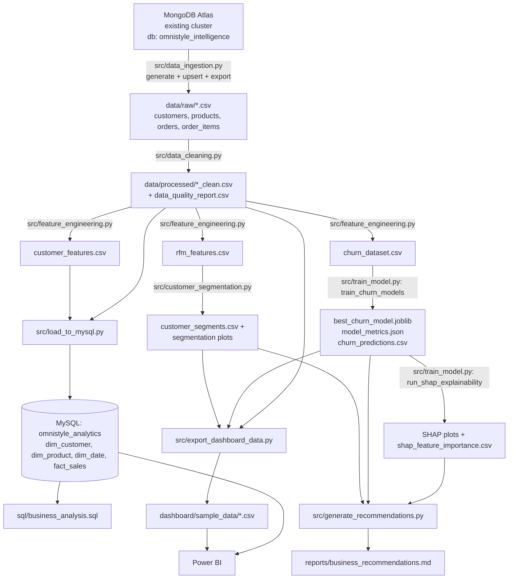

# Architecture

This document describes the actual, as-implemented architecture of the
OmniStyle Customer Intelligence Platform.

## High-level flow



ASCII fallback (in case Mermaid rendering is unavailable):

```
MongoDB Atlas (existing cluster, db=omnistyle_intelligence)
        |  src/data_ingestion.py
        v
data/raw/*.csv  (customers, products, orders, order_items)
        |  src/data_cleaning.py
        v
data/processed/*_clean.csv + data_quality_report.csv
        |  src/feature_engineering.py
        v
rfm_features.csv | customer_features.csv | churn_dataset.csv
        |                                        |
        |  src/customer_segmentation.py          |  src/train_model.py
        v                                        v
customer_segments.csv                   best_churn_model.joblib
        |                                 model_metrics.json
        |                                 churn_predictions.csv
        |                                        |
        |                                        v
        |                              SHAP plots + shap_feature_importance.csv
        |                                        |
        +----------------+-----------------------+
                          v
        src/generate_recommendations.py  -->  reports/business_recommendations.md
                          |
                          v
        src/export_dashboard_data.py --> dashboard/sample_data/*.csv --> Power BI

data/processed/*_clean.csv --> src/load_to_mysql.py --> MySQL (omnistyle_analytics)
                                                              |
                                                              v
                                                  sql/business_analysis.sql / Power BI
```

## Components

### 1. Data source: MongoDB Atlas

- `src/data_ingestion.py` connects to the user's **existing** Atlas cluster
  via `MONGODB_URI` and operates exclusively on the `MONGODB_DB` database
  (default `omnistyle_intelligence`), inside three collections: `customers`,
  `products`, `orders`. No other database or collection on the cluster is
  ever touched.
- If a collection is empty (or `--force-regenerate` is passed), the module
  generates deterministic synthetic data (`generate_all_synthetic_data`) and
  upserts it (`upsert_documents`, keyed on the natural ID field, so re-runs
  are idempotent).
- Regardless of whether MongoDB is configured, the module always ends by
  writing flat CSVs into `data/raw/` (`export_mongo_to_csv` when Mongo is
  used, or `_write_csvs` directly in CSV-only fallback mode), so every
  downstream stage is MongoDB-agnostic.

### 2. Cleaning layer

`src/data_cleaning.py` loads the raw CSVs, and for each table:
- Deduplicates on primary keys.
- Validates and repairs out-of-range values (age, price, cost, quantity,
  discount).
- Parses and validates dates.
- Cross-checks `orders.total_amount` against the sum of `order_items.line_total`
  for the same order, correcting the header total from the line-item detail
  (the line items are treated as the source of truth).
- Drops orphaned references (order items pointing to removed customers,
  orders, or products).
- Emits a full `DataQualityTracker` log to `data_quality_report.csv`.

### 3. Feature engineering layer

`src/feature_engineering.py` computes, strictly from data on/before a fixed
cutoff date:
- RFM features (`build_rfm_features`) and RFM quintile scores (`add_rfm_scores`).
- A broader customer feature table (`build_customer_features`): tenure,
  purchase counts, category diversity, discount sensitivity, and a
  90-day/90-day purchase trend ratio.
- A leakage-free churn label (`build_churn_labels`) based on activity in a
  strictly-future 90-day observation window. See `docs/methodology.md` for
  the full definition.

### 4. Analytics database: MySQL

`sql/schema.sql` defines a small star schema (`dim_customer`, `dim_product`,
`dim_date`, `fact_sales`). `src/load_to_mysql.py` truncates and reloads these
tables from the cleaned CSVs, building `dim_date` on the fly from the
observed order date range. `sql/business_analysis.sql` contains 17
business-question-driven SQL queries against this schema.

### 5. Machine learning layer

- **Segmentation** (`src/customer_segmentation.py`): K-Means on standardized
  RFM features, with `k` chosen via silhouette score within a
  business-actionable range, and labels assigned by *relative cluster
  ranking* rather than fixed thresholds or cluster IDs.
- **Churn prediction** (`src/train_model.py`): Logistic Regression baseline
  and Random Forest advanced model, trained on a leakage-free feature set,
  compared on ROC-AUC/precision/recall/F1, with the better model (by
  ROC-AUC) persisted to `models/best_churn_model.joblib`.
- **Explainability** (`src/train_model.py::run_shap_explainability`): SHAP
  `TreeExplainer` applied to the selected model when it is tree-based,
  producing a global summary plot, a ranked driver bar chart, and one local
  waterfall explanation for a high-risk customer.

### 6. Reporting and BI layer

- `src/generate_recommendations.py` reads every real artifact above
  (segments, churn predictions, SHAP importances, model metrics, cleaned
  sales data) and renders `reports/business_recommendations.md` using only
  computed values.
- `src/export_dashboard_data.py` produces business-friendly, Power BI-ready
  CSVs in `dashboard/sample_data/` (`sales_dashboard.csv`,
  `customer_dashboard.csv`, `customer_segments.csv`, `churn_predictions.csv`,
  `dim_date.csv`), independent of `src/train_model.py`'s own first-pass
  exports (`sales_detail.csv`, `customer_360.csv`, etc.), which are also
  preserved.
- `dashboard/power_bi_guide.md` documents how to wire these CSVs into a
  Power BI data model with recommended DAX measures.

### 7. Orchestration

`src/run_pipeline.py` runs all of the above in order (see its module
docstring for the exact function calls used per stage), with per-stage
timing, clear failure propagation, and an optional `--skip-mysql` flag for
environments without a local MySQL server.

## Design principles reflected in the code

- **No data leakage**: churn features and churn labels are computed from
  strictly non-overlapping time windows (see `docs/methodology.md`).
- **Single source of truth per concern**: segmentation logic lives only in
  `src/customer_segmentation.py`; `src/train_model.py` imports it rather
  than duplicating it.
- **Idempotent, rerunnable stages**: MongoDB writes use upserts; CSV/model
  outputs are simply overwritten on each run given the same
  `RANDOM_SEED`, so re-running the pipeline reproduces the same results.
- **Fail loud, not silent**: `src/run_pipeline.py` treats a non-zero exit
  code or exception from any required stage as fatal and halts the run,
  except for the explicitly optional MySQL stage.
